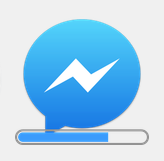

# electron-dl

> Simplified file downloads for your [Electron](https://electronjs.org) app

## Why?

- One function call instead of having to manually implement a lot of [boilerplate](index.js).
- Saves the file to the users Downloads directory instead of prompting.
- Bounces the Downloads directory in the dock when done. *(macOS)*
- Handles multiple downloads.
- Shows badge count *(macOS & Linux only)* and download progress. Example on macOS:



## Install

```sh
npm install electron-dl
```

*Requires Electron 30 or later.*

## Usage

### Register it for all windows

This is probably what you want for your app.

```js
import {app, BrowserWindow} from 'electron';
import electronDl from 'electron-dl';

electronDl();

let mainWindow;
(async () => {
	await app.whenReady();
	mainWindow = new BrowserWindow();
})();
```

### Use it manually

This can be useful if you need download functionality in a reusable module.

```js
import {BrowserWindow, ipcMain} from 'electron';
import {download, CancelError} from 'electron-dl';

ipcMain.on('download-button', async (event, {url}) => {
	const win = BrowserWindow.getFocusedWindow();
	try {
		console.log(await download(win, url));
	} catch (error) {
		if (error instanceof CancelError) {
			console.info('item.cancel() was called');
		} else {
			console.error(error);
		}
	}
});
```

## API

It can only be used in the [main](https://electronjs.org/docs/glossary/#main-process) process.

### electronDl(options?)

### download(window, url, options?): Promise<[DownloadItem](https://electronjs.org/docs/api/download-item)>

### window

Type: `BrowserWindow | WebContentsView`

The window to register the behavior on. Alternatively, a `WebContentsView` can be passed.

### url

Type: `string`

The URL to download.

### options

Type: `object`

#### saveAs

Type: `boolean`\
Default: `false`

Show a `Save As…` dialog instead of downloading immediately.

Note: Only use this option when strictly necessary. Downloading directly without a prompt is a much better user experience.

#### directory

Type: `string`\
Default: [User's downloads directory](https://electronjs.org/docs/api/app/#appgetpathname)

The directory to save the file in.

Must be an absolute path.

#### filename

Type: `string`\
Default: [`downloadItem.getFilename()`](https://electronjs.org/docs/api/download-item/#downloaditemgetfilename)

Name of the saved file.

This option only makes sense for `electronDl.download()`.

#### errorTitle

Type: `string`\
Default: `'Download Error'`

Title of the error dialog. Can be customized for localization.

Note: Error dialog will not be shown in `electronDl.download()`. Please handle error manually.

#### errorMessage

Type: `string`\
Default: `'The download of {filename} was interrupted'`

Message of the error dialog. `{filename}` is replaced with the name of the actual file. Can be customized for localization.

Note: Error dialog will not be shown in `electronDl.download()`. Please handle error manually.

#### onStarted

Type: `Function`

Optional callback that receives the [download item](https://electronjs.org/docs/api/download-item).
You can use this for advanced handling such as canceling the item like `item.cancel()` which will throw `electronDl.CancelError` from the `electronDl.download()` method.

#### onProgress

Type: `Function`

Optional callback that receives an object containing information about the progress of the current download item.

```js
{
	percent: 0.1,
	transferredBytes: 100,
	totalBytes: 1000
}
```

#### onTotalProgress

Type: `Function`

Optional callback that receives an object containing information about the combined progress of all download items done within any registered window.

Each time a new download is started, the next callback will include it. The progress percentage could therefore become smaller again.
This callback provides the same data that is used for the progress bar on the app icon.

```js
{
	percent: 0.1,
	transferredBytes: 100,
	totalBytes: 1000
}
```

#### onCancel

Type: `Function`

Optional callback that receives the [download item](https://electronjs.org/docs/api/download-item) for which the download has been cancelled.

#### onCompleted

Type: `Function`

Optional callback that receives an object with information about an item that has been completed. It is called for each completed item.

```js
{
	filename: 'file.zip',
	path: '/path/file.zip',
	fileSize: 503320,
	mimeType: 'application/zip',
	url: 'https://example.com/file.zip'
}
```

#### openFolderWhenDone

Type: `boolean`\
Default: `false`

Reveal the downloaded file in the system file manager, and if possible, select the file.

#### showBadge

Type: `boolean`\
Default: `true`

Show a file count badge on the macOS/Linux dock/taskbar icon when a download is in progress.

#### showProgressBar

Type: `boolean`\
Default: `true`

Show a progress bar on the dock/taskbar icon when a download is in progress.

#### overwrite

Type: `boolean`\
Default: `false`

Allow downloaded files to overwrite files with the same name in the directory they are saved to.

The default behavior is to append a number to the filename.

#### dialogOptions

Type: [`SaveDialogOptions`](https://www.electronjs.org/docs/latest/api/download-item#downloaditemsetsavedialogoptionsoptions)\
Default: `{}`

Customize the save dialog.

If `defaultPath` is not explicity defined, a default value is assigned based on the file path.

## Development

After making changes, run the automated tests:

```sh
npm test
```

And before submitting a pull request, run the manual tests to manually verify that everything works:

```sh
npm start
```

## Related

- [electron-debug](https://github.com/sindresorhus/electron-debug) - Adds useful debug features to your Electron app
- [electron-context-menu](https://github.com/sindresorhus/electron-context-menu) - Context menu for your Electron app
- [electron-store](https://github.com/sindresorhus/electron-store) - Save and load data like user settings, app state, cache, etc
- [electron-unhandled](https://github.com/sindresorhus/electron-unhandled) - Catch unhandled errors and promise rejections in your Electron app
